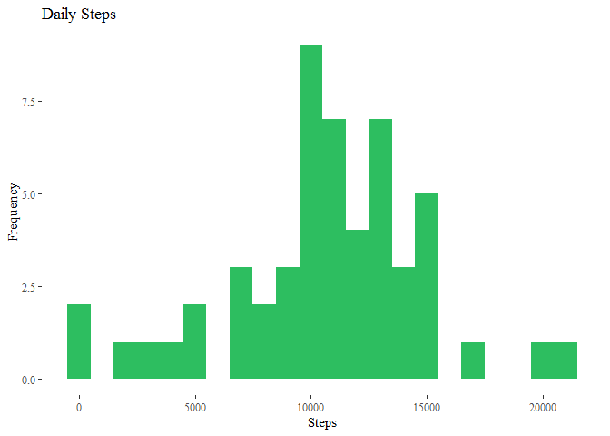
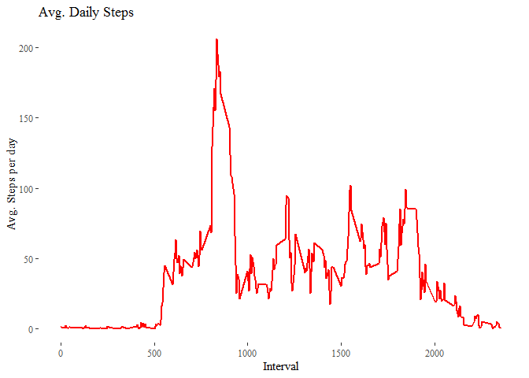
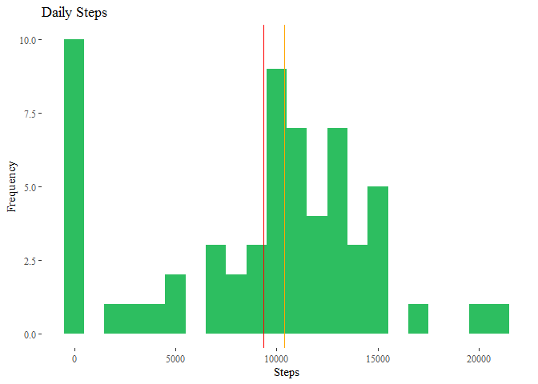
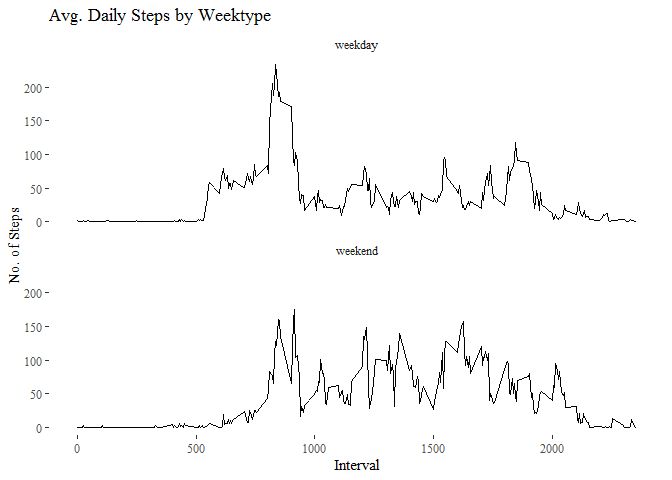

## Intro

This assignment makes use of data from a personal activity monitoring device. This device collects data at 5 minute intervals through out the day. The data consists of two months of data from an anonymous individual collected during the months of October and November, 2012 and include the number of steps taken in 5 minute intervals each day.

The data for this assignment can be downloaded from the course web site:

* Dataset: [Activity monitoring data](https://d396qusza40orc.cloudfront.net/repdata%2Fdata%2Factivity.zip) 

The variables included in this dataset are:

- *steps*: Number of steps taking in a 5-minute interval (missing values are coded as 𝙽𝙰) </br>
- *date*: The date on which the measurement was taken in YYYY-MM-DD format </br>
- *interval*: Identifier for the 5-minute interval in which measurement was taken </br>

The dataset is stored in a comma-separated-value (CSV) file and there are a total of 17,568 observations in this dataset. 

## Loading and preprocessing the data


Select a csv file from zip archive, then transform it to Data.Table:


```r
URL <- "https://d396qusza40orc.cloudfront.net/repdata%2Fdata%2Factivity.zip"
download.file(URL, destfile = paste0(getwd(), '/repdata%2Fdata%2Factivity.zip'), method = "curl")
unzip("repdata%2Fdata%2Factivity.zip",exdir = "data")

print("CSV is extracted!")
```

```
## [1] "CSV is extracted!"
```

```r
### Reading csv Data into Data.Table
dt_act <- data.table::fread(input = "data/activity.csv")

print("Data.Table is created!")
```

```
## [1] "Data.Table is created!"
```

## What is mean total number of steps taken per day?


```r
### 1. Calculate total number of steps per each day
all_steps_num <- dt_act[, c(lapply(.SD, sum, na.rm = FALSE)), .SDcols = c("steps"), by = .(date)]
head(all_steps_num,5)
```

```
##          date steps
## 1: 2012-10-01    NA
## 2: 2012-10-02   126
## 3: 2012-10-03 11352
## 4: 2012-10-04 12116
## 5: 2012-10-05 13294
```

```r
### 2. Plot histogram and mean on it
ggplot(all_steps_num, aes(x = steps)) +
    geom_histogram(fill = "#2dbe60", binwidth = 1000) +
    labs(title = "Daily Steps", x = "Steps", y = "Frequency") +
    # geom_vline(xintercept=central_m$steps_mean, linetype=1, colour="red") +
    # geom_vline(xintercept=central_m$steps_median, linetype=1, colour="orange") +
    theme_tufte()
```

```
## Warning: Removed 8 rows containing non-finite values (stat_bin).
```

<!-- -->

```r
### 3. Report the mean and median of the total number of steps taken per day
# calculate mean total number of steps
central_m <- all_steps_num%>%
    summarize(steps_mean = mean(steps, na.rm = TRUE),
              steps_median = median(steps, na.rm = TRUE)
              )
# report mean total number of steps
central_m
```

```
##   steps_mean steps_median
## 1   10766.19        10765
```

## What is the average daily activity pattern?


```r
### 1. Make a time series plot (i.e. \color{red}{\verb|type = "l"|}type = "l") of the 5-minute interval (x-axis) 
###    and the average number of steps taken, averaged across all days (y-axis)
dt_interval <- dt_act[, c(lapply(.SD, mean, na.rm = TRUE)), .SDcols = c("steps"), by = .(interval)] 

ggplot(dt_interval, aes(x = interval , y = steps)) + geom_line(color="red", size=1) + 
    labs(title = "Avg. Daily Steps", x = "Interval", y = "Avg. Steps per day") +
    theme_tufte()
```

<!-- -->

```r
### 2. Which 5-minute interval, on average across all the days in the dataset, contains the maximum number of steps?
dt_interval[steps == max(steps), .(max_interval = interval)]
```

```
##    max_interval
## 1:          835
```

## Imputing missing values


```r
### 1. Calculate and report the total number of missing values in the dataset 
### (i.e. the total number of rows with \color{red}{\verb|NA|}NAs) 

dt_act[is.na(steps), .N ]
```

```
## [1] 2304
```

```r
# Alternative method:

nrow(dt_act[is.na(steps),])
```

```
## [1] 2304
```

```r
### 2. Filling in all of the missing values in the dataset
dt_act[is.na(steps), "steps"] <- dt_act[, c(lapply(.SD, median, na.rm = TRUE)), .SDcols = c("steps")]

data.table::fwrite(x = dt_act, file = "data/tidyData.csv", quote = FALSE)

### 3. Create a new dataset that is equal to the original dataset but with the missing data filled in.
all_steps_num2 <- dt_act[, c(lapply(.SD, sum)), .SDcols = c("steps"), by = .(date)]
head(all_steps_num2, 5)
```

```
##          date steps
## 1: 2012-10-01     0
## 2: 2012-10-02   126
## 3: 2012-10-03 11352
## 4: 2012-10-04 12116
## 5: 2012-10-05 13294
```

```r
### mean and median total number of steps taken per day (new "enriched" dataset)
central_measures <- all_steps_num2%>%
    summarize(steps_mean2 = mean(steps),
              steps_median2 = median(steps)
              )

### 4.1. Make a histogram of the total number of steps taken each day
### Plot histogram + mean and median total number of steps taken per day
ggplot(all_steps_num2, aes(x = steps)) +
    geom_histogram(fill = "#2dbe60", binwidth = 1000) +
    labs(title = "Daily Steps", x = "Steps", y = "Frequency") +
    geom_vline(xintercept=central_measures$steps_mean2[1], linetype=1, colour="red") +
    geom_vline(xintercept=central_measures$steps_median2[1], linetype=1, colour="orange") +
    theme_tufte()
```

<!-- -->

```r
### 4.2. Calculate and report the mean and median total number of steps taken per day.
central_measures
```

```
##   steps_mean2 steps_median2
## 1     9354.23         10395
```

```r
### 4.3. Do these values differ from the estimates from the first part of the assignment?
```

- Yes, these values differ:

Type of Estimate | Mean Steps | Median Steps
--- | --- | ---
Centrality measures (with na) | 10766.19 | 10765
Centrality measures 2 (filling in NA with median) | 9354.23 | 10395


```r
### 4.4. What is the impact of imputing missing data on the estimates of the total daily number of steps?
# mean change
central_measures$steps_mean2[1] - central_m$steps_mean[1]
```

```
## [1] -1411.959
```

```r
# median change
central_measures[1,2] - central_m[1,2]
```

```
## [1] -370
```


## Are there differences in activity patterns between weekdays and weekends?


```r
### 1. Mark each observation “weekday” or “weekend” by a new factor binary indicator

all_steps_num3 <- data.table::fread(input = "data/activity.csv")
all_steps_num3[, date := as.POSIXct(date, format = "%Y-%m-%d")]
all_steps_num3[, `Day of Week`:= weekdays(x = date)]
# #FOR ENGLISH NAMES OF DAYS
# all_steps_num3[grepl(pattern = "Monday|Tuesday|Wednesday|Thursday|Friday", x = `Day of Week`), "weekday_or_weekend"] <- "weekday"
# all_steps_num3[grepl(pattern = "Saturday|Sunday", x = `Day of Week`), "weekday_or_weekend"] <- "weekend"
# 
# #FOR CYRYLLIC NAMES OF DAYS
# all_steps_num3[grepl(pattern = "понедельник|вторник|среда|четверг|пятница", x = `Day of Week`), "weekday_or_weekend"] <- "weekday"
# all_steps_num3[grepl(pattern = "суббота|воскресенье", x = `Day of Week`), "weekday_or_weekend"] <- "weekend"

all_steps_num3[grepl(pattern = "понедельник|вторник|среда|четверг|пятница", x = `Day of Week`), "weekday or weekend"] <- "weekday"
all_steps_num3[grepl(pattern = "суббота|воскресенье", x = `Day of Week`), "weekday or weekend"] <- "weekend"

all_steps_num3[, `weekday or weekend` := as.factor(`weekday or weekend`)]
head(all_steps_num3, 10)
```

```
##     steps       date interval Day of Week weekday or weekend
##  1:    NA 2012-10-01        0 понедельник            weekday
##  2:    NA 2012-10-01        5 понедельник            weekday
##  3:    NA 2012-10-01       10 понедельник            weekday
##  4:    NA 2012-10-01       15 понедельник            weekday
##  5:    NA 2012-10-01       20 понедельник            weekday
##  6:    NA 2012-10-01       25 понедельник            weekday
##  7:    NA 2012-10-01       30 понедельник            weekday
##  8:    NA 2012-10-01       35 понедельник            weekday
##  9:    NA 2012-10-01       40 понедельник            weekday
## 10:    NA 2012-10-01       45 понедельник            weekday
```

```r
### 2. Make a panel plot containing a time series plot (i.e. 𝚝𝚢𝚙𝚎 = "𝚕") of the 5-minute interval (x-axis) and the average number of steps taken, averaged across all weekday days or weekend days (y-axis).

names(all_steps_num3)[5] <- "weekday_or_weekend"

all_steps_num4 <- all_steps_num3%>%
    group_by(weekday_or_weekend, interval)%>%
    summarize(steps = mean(steps, na.rm=T))
head(all_steps_num4, 5)
```

```
## # A tibble: 5 x 3
## # Groups:   weekday_or_weekend [1]
##   weekday_or_weekend interval steps
##   <fct>                 <int> <dbl>
## 1 weekday                   0 2.33 
## 2 weekday                   5 0.462
## 3 weekday                  10 0.179
## 4 weekday                  15 0.205
## 5 weekday                  20 0.103
```

```r
ggplot(all_steps_num4 , aes(x = interval , y = steps), color="weekday_or_weekend") +
    geom_line() +
    labs(title = "Avg. Daily Steps by Weektype", x = "Interval", y = "No. of Steps") +
    facet_wrap(~weekday_or_weekend, ncol = 1, nrow=2) +
    theme_tufte()
```

<!-- -->
